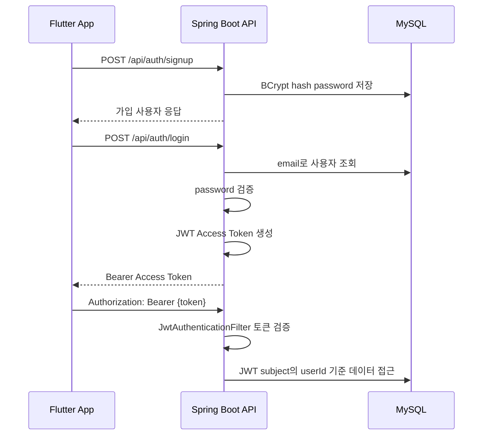
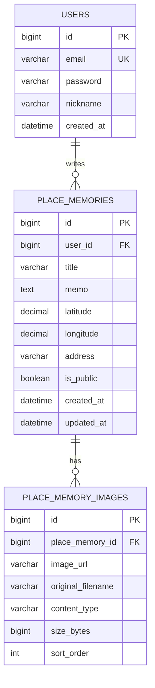

# Place Memory Archive Backend

> Firebase 기반 Flutter MVP였던 `장소 기억 아카이브`를 Spring Boot + MySQL 백엔드 API 서버로 재설계한 포트폴리오 프로젝트

GPS로 기록한 장소의 사진 URL, 메모, 좌표, 공개 여부를 저장하고 조회하는 API 서버입니다. 기존 MVP가 Firebase Auth, Cloud Firestore, Firebase Storage에 위임하던 책임을 직접 서버 구조로 옮기면서 인증/인가, 관계형 데이터 모델링, DB 마이그레이션, 공통 예외 응답, Swagger 문서화, 통합 테스트를 구현했습니다.

## Portfolio Highlights

| 평가 포인트 | 구현 내용 |
|---|---|
| 인증/인가 | Spring Security + JWT Access Token, 공통 401/403 JSON 응답, 작성자 권한 검증 |
| 데이터 모델링 | `User`, `PlaceMemory`, `PlaceMemoryImage`를 분리해 사용자, 장소 기록, 이미지 메타데이터 책임을 명확히 분리 |
| 운영 관점 | Flyway SQL 마이그레이션, `ddl-auto=validate`, Docker Compose MySQL 환경 |
| API 설계 | Controller / Service / Repository / DTO 계층 분리, 공통 응답 포맷, 페이지네이션 응답 |
| 테스트 | MockMvc 통합 테스트 6개로 회원가입, 로그인, JWT, CRUD, 검색, 권한, 페이지 응답 검증 |

## Test Result

최종 검증 명령:

```powershell
cd C:\project\place_archive_backend
.\mvnw.cmd test
```

검증 결과:

```text
Tests run: 6, Failures: 0, Errors: 0, Skipped: 0
BUILD SUCCESS
```

테스트는 H2를 MySQL 호환 모드로 실행하며, Flyway 마이그레이션 적용 후 Hibernate가 스키마를 검증합니다.

## Tech Stack

| 영역 | 기술 | 선택 이유 |
|---|---|---|
| Language | Java 17 | 일본 SI/웹 백엔드 채용에서 여전히 수요가 높고, Spring Boot 3의 기준 런타임으로 적합 |
| Framework | Spring Boot 3.3 | REST API, Validation, Security, JPA 구성을 표준적인 방식으로 보여주기 좋음 |
| Database | MySQL 8.4 | 일본 백엔드 채용 공고에서 자주 요구되는 관계형 DB이며, 위치/사용자/이미지 관계를 명확히 표현 가능 |
| ORM | Spring Data JPA / Hibernate | Repository 추상화와 트랜잭션 기반 도메인 변경 흐름을 보여주기 좋음 |
| Migration | Flyway | 운영 DB 변경 이력을 SQL로 관리하고, `ddl-auto:update` 의존을 피하기 위함 |
| Auth | Spring Security + JWT | 모바일 앱과 분리된 stateless API 인증 흐름을 구현하기 위함 |
| API Docs | Springdoc OpenAPI / Swagger UI | 채용 담당자와 면접관이 브라우저에서 API를 직접 테스트할 수 있게 하기 위함 |
| Test | JUnit 5, MockMvc, H2 | 실제 HTTP 요청 흐름으로 인증, 권한, DB 저장 결과를 검증하기 위함 |
| Local Infra | Docker Compose | MySQL 실행 환경을 한 명령으로 재현하기 위함 |

## Features

| 기능 | Endpoint |
|---|---|
| 회원가입 | `POST /api/auth/signup` |
| 로그인 및 JWT 발급 | `POST /api/auth/login` |
| 장소 기록 생성 | `POST /api/place-memories` |
| 내 장소 기록 목록 조회 | `GET /api/place-memories/me?page=0&size=20` |
| 장소 기록 상세 조회 | `GET /api/place-memories/{id}` |
| 장소 기록 수정 | `PATCH /api/place-memories/{id}` |
| 장소 기록 삭제 | `DELETE /api/place-memories/{id}` |
| 공개 장소 기록 목록 조회 | `GET /api/place-memories/public?page=0&size=20` |
| 공개 장소 기록 키워드 검색 | `GET /api/place-memories/public?keyword=sakura&page=0&size=20` |
| 이미지 URL 메타데이터 저장 | `PlaceMemoryImage`로 URL, 원본 파일명, MIME type, size, 정렬 순서 저장 |

## Architecture

```text
src/main/java/com/example/placearchive
├── auth      # 회원가입, 로그인, 토큰 발급
├── common    # 공통 API 응답, 페이지 응답, 공통 예외 처리
├── config    # Swagger/OpenAPI 설정
├── place     # 장소 기록 도메인, 서비스, 컨트롤러, DTO
├── security  # JWT 필터, 인증 주체, Security 설정, 401/403 처리
└── user      # 사용자 엔티티와 Repository
```

Controller는 HTTP 요청/응답과 검증 어노테이션을 담당합니다. Service는 유스케이스, 트랜잭션, 작성자 권한 검증을 담당합니다. Repository는 JPA 조회와 검색 조건만 책임집니다. 이 분리는 Flutter 클라이언트가 바뀌어도 서버의 API 계약과 비즈니스 규칙을 유지하기 위한 선택입니다.

## Authentication Design



JWT의 subject에는 `userId`를 저장합니다. 요청마다 `JwtAuthenticationFilter`가 토큰을 검증하고 `UserPrincipal`을 SecurityContext에 등록합니다. 이후 컨트롤러는 `@AuthenticationPrincipal`로 현재 사용자를 받고, 서비스 계층에서 해당 사용자 기준으로 데이터 접근 권한을 판단합니다.

## Authorization Design

| 기능 | 권한 규칙 | 구현 위치 |
|---|---|---|
| 내 목록 조회 | JWT의 `userId`와 일치하는 기록만 조회 | `PlaceMemoryService.findMine` |
| 상세 조회 | 공개 기록은 인증 사용자에게 조회 허용, 비공개 기록은 작성자만 허용 | `PlaceMemoryService.findOne` |
| 수정 | 작성자만 가능 | `PlaceMemoryService.update` |
| 삭제 | 작성자만 가능 | `PlaceMemoryService.delete` |
| 공개 목록/검색 | 로그인 없이 `isPublic = true` 기록만 조회 | `PlaceMemoryService.findPublic` |

권한 검증을 컨트롤러가 아니라 서비스 계층에 둔 이유는 HTTP 밖의 유스케이스에서도 같은 정책을 재사용하기 위해서입니다. 권한 위반은 `FORBIDDEN` 공통 응답으로 내려가며, 인증 실패는 `UNAUTHORIZED` 공통 응답으로 분리했습니다.

## Data Modeling



### Modeling Decisions

| 모델 | 설계 이유 |
|---|---|
| `User` | 로그인 식별자인 email에 unique 제약을 두고, 비밀번호는 BCrypt hash로 저장 |
| `PlaceMemory` | 장소 기록의 본문, 좌표, 주소, 공개 여부를 하나의 aggregate root로 관리 |
| `PlaceMemoryImage` | 이미지 자체 업로드가 아니라 URL 메타데이터를 여러 개 저장할 수 있게 별도 테이블로 분리 |
| `isPublic` | 공개 피드와 개인 기록을 같은 테이블에서 권한 조건으로 분리 |
| 인덱스 | 내 목록과 공개 목록 조회를 고려해 `(user_id, created_at)`, `(is_public, created_at)` 인덱스 추가 |

Firestore 문서 구조에서는 유연성이 장점이지만, 이 백엔드에서는 관계형 DB의 FK, unique 제약, 인덱스를 통해 데이터 무결성과 조회 의도를 명확히 했습니다.

## API Response

성공:

```json
{
  "success": true,
  "data": {
    "id": 1
  },
  "error": null
}
```

페이지 목록:

```json
{
  "success": true,
  "data": {
    "content": [],
    "page": 0,
    "size": 20,
    "totalElements": 0,
    "totalPages": 0,
    "hasNext": false
  },
  "error": null
}
```

실패:

```json
{
  "success": false,
  "data": null,
  "error": {
    "code": "FORBIDDEN",
    "message": "접근 권한이 없습니다."
  }
}
```

공통 응답 포맷을 둔 이유는 Flutter 클라이언트가 HTTP status와 `error.code`를 함께 보고 동일한 방식으로 오류를 처리할 수 있게 하기 위해서입니다.

## Database Migration

운영 DB에서는 Hibernate의 `ddl-auto:update`에 의존하지 않습니다.

```text
src/main/resources/db/migration/V1__create_users_and_place_memories.sql
```

`spring.jpa.hibernate.ddl-auto=validate`를 사용해 서버 시작 시 엔티티와 실제 DB 스키마가 맞는지 검증합니다. 스키마 변경은 Flyway SQL 파일로 남기므로, 팀 개발이나 배포 환경에서도 변경 이력을 추적할 수 있습니다.

## Firebase MVP와의 차이

| Firebase MVP | Spring Boot Backend |
|---|---|
| Firebase Auth가 인증 처리 | Spring Security가 로그인 검증, BCrypt, JWT 발급 처리 |
| Firestore 문서 중심 저장 | MySQL 관계형 모델로 User, PlaceMemory, Image 정규화 |
| Firestore Security Rules에 권한 위임 | Service 계층에서 작성자 권한과 공개 범위 검증 |
| 콘솔/SDK가 스키마 변경을 흡수 | Flyway SQL 마이그레이션으로 DB 변경 이력 관리 |
| Firebase Storage URL을 클라이언트 중심으로 관리 | 서버가 이미지 URL, 파일명, MIME type, size 메타데이터 저장 |
| 클라이언트가 데이터 구조를 직접 많이 앎 | DTO와 공통 API 응답 형식으로 서버 계약을 고정 |
| Firebase 콘솔 설정 의존 | Docker Compose로 로컬 MySQL 환경 재현 |

## Run Locally

### 1. MySQL 실행

```bash
docker compose up -d
```

### 2. 서버 실행

```bash
./mvnw spring-boot:run
```

Windows PowerShell:

```powershell
.\mvnw.cmd spring-boot:run
```

기본 접속 정보:

```text
API: http://localhost:8080
Swagger UI: http://localhost:8080/swagger-ui.html
MySQL: localhost:3306/place_archive
```

환경 변수:

```bash
SPRING_DATASOURCE_URL=jdbc:mysql://localhost:3306/place_archive
SPRING_DATASOURCE_USERNAME=place_user
SPRING_DATASOURCE_PASSWORD=place_password
JWT_SECRET=change-this-to-a-long-random-secret-value
JWT_ACCESS_TOKEN_EXPIRATION_MINUTES=60
```

Swagger UI에서 `POST /api/auth/login`으로 받은 토큰을 Authorize 버튼에 입력하면 인증 API를 테스트할 수 있습니다.

## Test

```bash
./mvnw test
```

Windows PowerShell:

```powershell
.\mvnw.cmd test
```

테스트 범위:

| 테스트 | 검증 내용 |
|---|---|
| `signupAndLoginIssuesAccessToken` | 회원가입 후 로그인 시 JWT Access Token 발급 |
| `signupRejectsDuplicatedEmail` | 중복 이메일 가입 차단 |
| `authenticatedUserCreatesAndReadsOwnPlaceMemoryWithImages` | 인증 사용자 장소 기록 생성, 상세 조회, 이미지 URL 메타데이터 저장 |
| `onlyAuthorCanUpdateOrDeletePlaceMemory` | 작성자 외 수정/삭제 차단과 공통 403 응답 |
| `publicListAndKeywordSearchReturnOnlyPublicMatchingMemories` | 공개 기록만 검색 결과에 노출 |
| `publicListSupportsPaginationMetadata` | 공개 목록의 페이지 메타데이터 반환 |
