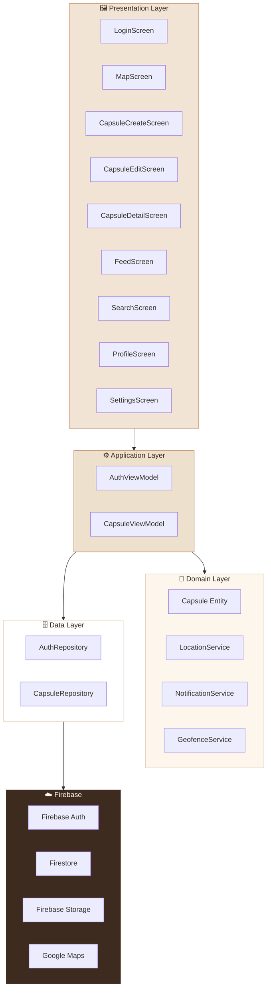

# 아키텍처 문서

## 개요

장소 기억 아카이브는 **레이어드 아키텍처(Layered Architecture)** 를 적용합니다.
UI, 비즈니스 로직, 도메인 규칙, 데이터 접근을 4개 층으로 분리하여 각 층이 단일 책임을 갖습니다.

---

## 전체 아키텍처 다이어그램



---

## 레이어별 책임

### 🖼 Presentation Layer

**역할:** 사용자에게 UI를 렌더링하고 입력을 받는다.

**규칙:**
- 비즈니스 로직을 직접 처리하지 않는다
- ViewModel을 통해서만 데이터를 요청한다
- Firebase, Geolocator 등 외부 라이브러리를 직접 호출하지 않는다

**파일 위치:** `lib/presentation/screens/`, `lib/presentation/widgets/`, `lib/presentation/theme/`

| 화면 | 역할 |
|------|------|
| LoginScreen | 이메일/비밀번호 로그인, 회원가입 |
| MapScreen | 지도 + 내 캡슐 목록 조회 |
| CapsuleCreateScreen | 새 캡슐 생성 (GPS + 메모 + 사진) |
| CapsuleEditScreen | 기존 캡슐 수정 |
| CapsuleDetailScreen | 캡슐 상세 조회, 삭제 |
| FeedScreen | 공개 캡슐 피드 |
| SearchScreen | 메모 내용 검색 |
| ProfileScreen | 프로필 + 통계 |
| SettingsScreen | 알림 설정, 비밀번호 재설정, 계정 삭제 |

---

### ⚙️ Application Layer

**역할:** 비즈니스 로직을 처리하고 UI와 데이터 사이를 중개한다.

**규칙:**
- `ChangeNotifier`를 상속하여 Provider로 상태를 관리한다
- Repository를 통해서만 데이터에 접근한다
- UI 관련 코드(Widget, BuildContext)를 포함하지 않는다

**파일 위치:** `lib/application/view_models/`

| ViewModel | 책임 |
|-----------|------|
| AuthViewModel | 로그인/로그아웃/회원가입 상태 관리, Firebase Auth 스트림 구독 |
| CapsuleViewModel | 캡슐 CRUD, Firestore 실시간 스트림 구독, Geofence 연동 |

---

### 🧩 Domain Layer

**역할:** 앱의 핵심 개념과 규칙을 정의한다. 외부 기술에 의존하지 않는다.

**규칙:**
- Firebase, Flutter 패키지에 의존하지 않는다
- 순수한 Dart 코드로만 구성한다
- 비즈니스 규칙의 변경은 이 레이어에서만 일어난다

**파일 위치:** `lib/domain/entities/`, `lib/domain/services/`

| 파일 | 책임 |
|------|------|
| Capsule (Entity) | 캡슐 데이터 모델 정의 (id, userId, lat, lng, memo, photoUrls, isPublic, createdAt) |
| LocationService | GPS 위치 수집, 권한 요청 처리 |
| NotificationService | 로컬 알림 초기화 및 발송 |
| GeofenceService | 위치 스트림 구독, 100m 이내 진입 감지, 알림 트리거 |

---

### 🗄 Data Layer

**역할:** 외부 데이터 소스(Firebase)와의 모든 통신을 담당한다.

**규칙:**
- Firebase SDK를 직접 호출하는 유일한 레이어
- Domain Entity로 변환하여 반환한다
- 네트워크 오류, 권한 오류 등 외부 예외를 처리한다

**파일 위치:** `lib/data/repositories/`

| Repository | 책임 |
|------------|------|
| AuthRepository | Firebase Auth 래퍼 (signIn, signUp, signOut, authStateChanges) |
| CapsuleRepository | Firestore CRUD, 실시간 스트림, Storage 업로드/삭제 |

---

## 디렉토리 구조

```
lib/
├── main.dart                          # 앱 진입점, Firebase 초기화
├── app.dart                           # MaterialApp, Provider, AuthGate
│
├── presentation/
│   ├── screens/
│   │   ├── login_screen.dart
│   │   ├── map_screen.dart
│   │   ├── capsule_create_screen.dart
│   │   ├── capsule_edit_screen.dart
│   │   ├── capsule_detail_screen.dart
│   │   ├── feed_screen.dart
│   │   ├── search_screen.dart
│   │   ├── profile_screen.dart
│   │   └── settings_screen.dart
│   ├── widgets/                       # 재사용 위젯
│   └── theme/
│       └── app_theme.dart             # 색상, 폰트, 테마 설정
│
├── application/
│   └── view_models/
│       ├── auth_view_model.dart
│       └── capsule_view_model.dart
│
├── domain/
│   ├── entities/
│   │   └── capsule.dart
│   └── services/
│       ├── location_service.dart
│       ├── notification_service.dart
│       └── geofence_service.dart
│
├── data/
│   └── repositories/
│       ├── auth_repository.dart
│       └── capsule_repository.dart
│
└── firebase_options.dart              # FlutterFire CLI 자동 생성
```

---

## 데이터 흐름

### 로그인 흐름

```
LoginScreen
  → AuthViewModel.signIn(email, password)
    → AuthRepository.signIn()
      → FirebaseAuth.signInWithEmailAndPassword()
  ← authStateChanges 스트림으로 상태 변경
  ← AuthGate가 MapScreen으로 자동 전환
```

### 캡슐 생성 흐름

```
CapsuleCreateScreen
  → LocationService.getCurrentPosition()     # GPS 위치 수집
  → CapsuleViewModel.createCapsule(capsule)
    → CapsuleRepository.createCapsule()
      → Firestore.collection('capsules').add()
  ← watchUserCapsules 스트림으로 목록 자동 업데이트
  ← 지도 마커 자동 반영
```

### Geofencing 흐름

```
CapsuleViewModel.startWatching()
  → GeofenceService.start()
    → Geolocator.getPositionStream()         # 위치 스트림 구독
      → 20m 이동마다 체크
        → Geolocator.distanceBetween()       # 캡슐과 거리 계산
          → 100m 이내 진입 감지
            → NotificationService.showGeofenceNotification()
```

---

## 상태관리 패턴

Provider + ChangeNotifier 패턴을 사용합니다.

```dart
// app.dart — Provider 등록
MultiProvider(
  providers: [
    ChangeNotifierProvider(create: (_) => AuthViewModel(AuthRepository())),
    ChangeNotifierProvider(create: (_) => CapsuleViewModel(CapsuleRepository())),
  ],
)

// 화면에서 읽기 (rebuild 트리거)
final auth = context.watch<AuthViewModel>();

// 화면에서 쓰기 (rebuild 트리거 안 함)
context.read<CapsuleViewModel>().createCapsule(capsule);
```

---

## 기술 의사결정 (ADR 요약)

| ADR | 결정 | 근거 |
|-----|------|------|
| ADR-0001 | Flutter 선택 | iOS + Android 크로스플랫폼, Dart 생산성 |
| ADR-0002 | Provider 선택 | Flutter 공식 권장, 학습 부담 최소화 |
| ADR-0003 | Firebase 선택 | Auth + Firestore + Storage 통합, 실시간 동기화 |
| ADR-0004 | Google Maps 선택 | 한국 지도 데이터 품질, 공식 Flutter 패키지 |
| ADR-0005 | Geolocator 선택 | Flutter 최다 사용 GPS 패키지, 권한 처리 내장 |
| ADR-0006 | 다이어리 UI | 앱 컨셉과 일관성, 1020 타겟 감성 차별화 |
